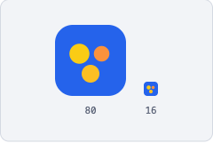
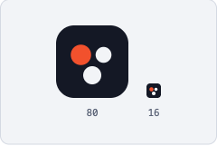

# 변경 이력 — 알콜미터 web

> 각 판(版)은 *이탤릭 인용문*으로 그날의 짧은 이야기를 연 뒤,
> 무엇이 바뀌었는지 또렷한 항목으로 잇습니다. — 양조장 밤일지

## [1.12.1] — 2026-08-01

> *칸 안에서는 쓰이지 않는 도구들이 조용히 손을 내렸습니다. 눌러도 아무 일이 없던 까닭을 이제 눌러 보기 전에 아실 수 있습니다.*

- **비활성 표시**: 표 칸 안에 커서를 두면 소제목·인용구·글머리 목록·번호 목록·구분선 버튼이 흐려집니다. 표 칸은 한 줄 서식만 담을 수 있어 여태도 눌리지 않았는데, 이제는 눌리지 않는다는 것이 눈에 보입니다.
- **그대로 쓰는 서식**: 굵게·기울임·취소선·링크는 표 칸 안에서도 그대로 쓰실 수 있습니다.

## [1.12.0] — 2026-08-01

> *줄줄이 적어 내려가기만 했던 자리에 가로세로 금이 새로 들어앉았습니다. 어느 재료가 몇 근인지 세로로 훑으면 바로 드러나니, 눈대중은 접어 두셔도 됩니다.*

- **표 만들기**: 알콜위키와 커뮤니티 편집기 툴바에 표 버튼이 생겼습니다. 누르면 세 칸 표가 들어서고, 커서를 표 안에 두면 행과 열을 더하거나 지우는 줄이 따로 열립니다.
- **열 정렬**: 열 단위로 왼쪽·가운데·오른쪽 정렬을 고를 수 있습니다. 숫자 열을 오른쪽으로 붙여 두면 자릿수가 맞아떨어집니다.
- **Tab으로 칸 옮기기**: Tab과 Shift+Tab으로 칸을 옮겨 다니고, 마지막 칸에서 Tab을 누르면 행이 하나 늘어납니다.
- **표가 살아남는 수정**: 표가 든 문서를 다시 수정해도 표가 그대로 남습니다. 여태는 수정 화면에 들어서는 순간 표가 평문으로 흩어졌습니다.
- **열 폭 고정**: 한 칸에 글을 길게 적어도 다른 열이 밀려 좁아지지 않고, 긴 글은 칸 안에서 줄바꿈됩니다.
- **요약 손질**: 커뮤니티 글 목록과 공유 카드의 요약에서 표 기호가 사라졌습니다.

## [1.11.0] — 2026-07-30

> *커뮤니티에 글을 앉히는 자리를 통째로 새로 짰습니다. 붓도 바뀌고 책상도 넓어졌으니, 이제 손이 가는 대로 적어 두시면 됩니다.*

- **새 글쓰기**: 알콜위키와 같은 서식 편집기로 바꿨습니다. 소제목·굵게·기울임·목록·인용·링크·구분선을 쓸 수 있고, Enter로 다음 문단이 열립니다. "문단"과 "소문단"을 손수 나눠 담던 옛 입력 방식은 사라졌습니다.
- **초안 보관**: 쓰던 글을 브라우저에 자동으로 담아 둡니다. 저장하지 않은 채 화면을 벗어나려 하면 먼저 여쭙고, 다시 들어오시면 이어서 쓸지 물어봅니다.
- **저장 전 확인**: 발행·수정·삭제를 누르면 확인 창으로 한 번 더 여쭙고, 저장하는 동안에는 진행 창이 떠서 겹치는 일을 막습니다. 실패하면 사유를 안내 창으로 또렷이 알려 드립니다.
- **데스크톱 화면**: 목록은 넓은 폭으로 펼쳐지고, 글 본문과 편집 화면도 읽고 쓰기 좋은 폭으로 넓어졌습니다.
- **게시판형 목록**: 제목·작성자·날짜가 칸을 맞춰 늘어섭니다. 글이 스무 편을 넘으면 페이지를 넘겨 옛 글까지 닿을 수 있고, 좁은 화면에서는 두 줄로 접힙니다.
- **위키로 잇는 글**: 글 안에서 알콜위키 용어로 곧장 이어지는 링크를 쓸 수 있습니다.
- **글쓰기 입구**: 로그인하지 않으셨어도 글쓰기 입구가 보입니다. 눌러서 로그인을 마치면 쓰려던 자리로 돌아옵니다.

## [1.10.0] — 2026-07-27

> *알콜위키의 손놀림에 신중함이 자리를 잡았습니다. 새기기 전에 한 번 여쭙고, 새기는 동안에는 숨을 고르며, 어긋나면 어긋났다고 말씀드립니다.*

- **저장 전 확인**: 알콜위키에서 게시·수정·되돌리기를 누르면 바로 저장하지 않고, 정말 진행할지 확인 창으로 한 번 더 여쭙습니다.
- **저장 중 표시**: 저장하는 동안에는 닫히지 않는 진행 창이 떠서, 저장이 겹치거나 중간에 끊기는 일을 막습니다.
- **실패 안내**: 저장이 실패하면 화면 구석 한 줄 대신 안내 창으로 사유를 또렷이 알려 드립니다.
- **중복 미리 확인**: 새 용어를 게시하기 전에 같은 이름의 문서가 있는지 먼저 살피고, 있으면 기존 문서를 수정하시도록 안내합니다.

## [1.9.0] — 2026-07-27

> *위키를 적는 붓끝에 새 재간이 붙었습니다. 항목 아래로 항목이 층층이 들어앉고, 층을 오르내려도 붓은 제자리를 잃지 않습니다.*

- **목록 안의 목록**: 알콜위키 에디터에서 목록 항목을 Tab과 Shift+Tab, 툴바의 들여쓰기·내어쓰기 버튼으로 층층이 중첩할 수 있습니다. 순서·비순서 목록을 가리지 않고, 저장과 재수정에도 층이 그대로 남습니다.
- **마커로 목록 열기**: 빈 줄에 `-`나 숫자를 적고 Tab이나 Space를 누르면 그 자리에서 목록이 열립니다. 목록 안에서 같은 동작을 하면 그 종류의 중첩 목록이 만들어집니다.
- **목록 종류 전환 손질**: 글머리·번호 버튼이 커서가 놓인 목록 층 전체를 한 번에 전환하고, 버튼 불빛도 지금 서 있는 층 기준으로 정확히 들어옵니다.
- **표시 다듬기**: 편집 화면과 용어 본문에서 중첩 목록의 간격을 정돈했고, 서식이 켜져 있으면 안내 문구가 슬며시 비켜섭니다.

## [1.8.3] — 2026-07-27

> *다녀간 길을 되짚을 때마다 번번이 앞을 막아서던 문지기에게, 볼일이 끝난 손님은 그냥 지나가시게 하라고 슬쩍 일러두었습니다.*

- **뒤로 가기 손질**: 로그인을 마친 뒤 뒤로 가기를 누르면 로그인 페이지에 다시 걸리지 않고 그 이전 화면으로 곧장 돌아갑니다.
- **튕김 제거**: 로그인이 필요한 작성·수정 화면에서 로그인으로 안내될 때도 흔적을 남기지 않아, 뒤로 가기가 두 화면 사이를 오가며 튕기던 일이 사라집니다.

## [1.8.2] — 2026-07-27

> *알콜위키 푸터를 조용히 다시 정돈했습니다. 찾던 길잡이가 눈길이 먼저 닿는 자리로 옮겨 앉았습니다.*

- **「이용 안내」 자리 이동**: 알콜위키 화면에서만 보이는 이 링크를 「자주 묻는 질문」 바로 위로 옮겨, 다른 링크들과 나란히 읽히도록 했습니다.

## [1.8.1] — 2026-07-26

> *소제목과 목록을 한 덩이로 뭉개 놓던 저장 버릇을 조용히 바로잡았습니다. 애써 단을 나눠 적어도 밤새 평문으로 되돌려 놓던 손이, 이제는 나눈 대로 받아 적습니다.*

- **소제목·목록이 살아남습니다**: 알콜위키 본문을 저장할 때 소제목과 목록이 표시만 사라진 평문으로 뭉개지던 문제를 고쳤습니다. 이제 쓴 구조 그대로 저장되고, 조회 화면에도 그대로 나옵니다.
- **인용구와 목록 속 여러 문단**: 문단이 여럿인 인용구, 문단이 여럿인 목록 항목도 구조를 지킨 채 저장됩니다.
- **목록 순서 교정**: 목록 항목 안에 딸린 하위 목록이 뒤로 밀리던 것을 바로잡아, 쓴 순서대로 남습니다.

## [1.8.0] — 2026-07-26

> *한여름 장부를 정리하다, 떠나겠다는 이의 이름을 지우는 법을 마련했습니다. 이제 설정 한 켠에서 스스로 문을 나설 수 있고, 함께 쓴 글은 이름만 지운 채 자리를 지킵니다.*

- **회원 탈퇴 신설**: 로그인한 뒤 설정 페이지에서 직접 회원 탈퇴를 할 수 있습니다. 탈퇴하면 계정과 로그인 정보가 지체 없이 삭제됩니다.
- **남긴 글은 익명으로**: 알콜위키·커뮤니티에 남긴 글은 지우지 않고 작성자만 '익명'으로 바꿔, 함께 쌓은 기록은 그대로 둡니다.
- **되돌릴 수 없는 일에는 한 번 더**: 탈퇴를 누르면 화면 한가운데 확인 창을 띄워 정말 떠날지 다시 여쭙니다.
- **개인정보처리방침 갱신**: 이용자의 권리 항목을 앱 안에서 직접 탈퇴하는 길로 고쳐 적고, 시행일을 새로 새겼습니다.

## [1.7.0] — 2026-07-26

> *어디에 링크를 붙여도 「전통주 양조 계산기」라고만 자기를 소개하던 미리보기 카드를 앉혀 놓고 새로 가르쳤습니다. 이제 커뮤니티인지 알콜위키인지 계산기인지, 제 이름을 대고 나섭니다.*

- **공유 카드 새 얼굴**: 링크를 붙였을 때 뜨는 미리보기 이미지 9종을 다시 그렸습니다. 커뮤니티·알콜위키·이용 안내·사이다 계산기 몫이 새로 생겼고, 각 이미지가 계산기가 아니라 자기 섹션의 이름을 답니다.
- **글마다 제 얼굴로**: 커뮤니티 글과 알콜위키 용어를 공유하면 제목과 작성자, 쓴 시각과 고친 시각이 함께 실립니다. 대표 이미지를 등록한 문서는 그 이미지가 카드에 오르고, 없으면 섹션 공통 이미지로 대신합니다.
- **어긋나던 미리보기 교정**: 올린 이미지의 크기를 1200×630으로 잘못 알려 카드가 어긋나던 것을 바로잡았습니다. 이제 크기를 아는 이미지만 크기를 알립니다.
- **바뀐 소개 문구**: 홈·커뮤니티·알콜위키의 제목과 설명을 「술을 빚는 사람과 즐기는 사람 모두의 커뮤니티」로 다시 적었습니다. 알콜위키는 전통주에 머물지 않고 술 전반의 낱말을 담는다고 밝힙니다.
- **검색엔진에 건네는 명함**: 사이트 전체에 발행 주체 정보를 심고, 커뮤니티 글이 사이트맵에 자동으로 오르도록 했습니다.
- **작성 화면은 조용히**: 로그인·글쓰기·수정 화면이 검색 결과에 새지 않도록 두 겹으로 막았습니다.

## [1.6.1] — 2026-07-26

> *어제 문 연 사이다 계산기에 깨알같은 손질이 슬쩍 다녀갔습니다. 결과표 안에 묻혀 있던 과가당 경고를 안내 문구 바로 아래로 끌어올려, 눈에 먼저 들도록 했습니다.*

- **경고 위치 손질**: 설탕을 과하게 넣을 때 뜨는 발효 정지 경고를, 결과표 안이 아니라 항상 보이는 안내 문구 바로 아래에 나오도록 옮겼습니다.
- **읽기 쉽게**: 그 경고를 한 줄에 한 문장씩 끊어 정리했습니다.

## [1.6.0] — 2026-07-25

> *막걸리 곁에 사이다 계산기가 자리를 잡았습니다. 사과와 품종만 고르면 도수를 짚어 드리고, 사이다는 원래 드라이하다며 설탕을 들이붓는 손은 점잖게 말립니다.*

- **사이다 계산기 신설**: 사과 양과 품종(후지·홍옥·홍로·아오리)을 넣으면 하드 사이다의 예상 도수와 생산량을 계산합니다. `/calculate-cider`.
- **믿을 만한 숫자**: 예상 도수를 실제 사과 발효에 맞춰 현실적인 범위(사과만으로 대개 5~8%)로 잡았습니다 (domain-v2 0.5.0).
- **드라이가 기본**: 사이다는 끝까지 발효돼 드라이하게 완성됩니다. 달게 만들려면 발효 후 가당(백스위트닝)하거나 저온으로 멈추도록 일러 드립니다.
- **과한 가당엔 경고**: 설탕을 효모가 견디는 선 너머로 넣으면 발효가 멈추고 잔당이 남는다고 미리 알려 드립니다.
- **홈에서 바로**: 홈의 '준비 중'을 떼고 사이다 계산기로 곧장 들어가도록 열었습니다.
- **푸터 정돈**: 푸터 링크를 계산기·콘텐츠·설정으로 갈래를 나눠 정리하고, 사이다 계산기를 그 곁에 세웠습니다.
- **막걸리도 손질**: 막걸리 계산기에 상시 안내를 더하고, 안내를 결과 곁 위쪽으로 옮겼습니다.

## [1.5.0] — 2026-07-25

> *누구나 손대는 위키에도 지켜야 할 선이 있는 법입니다. 문서의 라이선스와 편집 규칙, 신고와 면책을 한 장에 눌러 담은 「이용 안내」가 자리를 잡았습니다.*

- **위키 이용 안내 신설**: 알콜위키에 문서 라이선스(CC BY-SA 4.0), 편집 규칙, 신고 방법, 정확성·책임 면책을 담은 이용 안내 문서를 새로 열었습니다.
- **어디서든 닿게**: 위키 목록과 위키 화면 아래 푸터에서 이용 안내로 바로 건너가도록 링크를 걸었습니다.
- **데스크탑 정돈**: 위키 목록을 홈과 같은 넓은 폭에 맞추고, 이용 안내는 제목을 곁에 세운 2단으로 읽기 편하게 폈습니다.
- **참여는 검색 곁에서**: 목록의 '새 용어 추가'를 검색창 아래로 옮겨, 찾다가 없으면 바로 보태도록 흐름을 정리했습니다.

## [1.4.0] — 2026-07-25

> *한여름 밤, 문을 닫기 전 장부를 다시 폅니다. 그동안 어떤 것을 받아 적었는지, 어디에 맡겨 두었는지, 언제까지 곁에 두는지 숨김없이 적어 내려갑니다. 넓은 화면에서는 글 곁에 이정표를 세워, 긴 문서에서도 길을 잃지 않으시도록 했습니다.*

- **개인정보처리방침 전면 개정**: 로그인과 알콜위키·커뮤니티가 생기며 실제로 다루게 된 정보를 사실대로 다시 적었습니다. 수집하는 항목, 이용 목적, 처리 위탁과 국외 이전, 보유·파기 기간, 이용자의 권리를 항목별로 나눠 밝힙니다.
- **데스크탑 사이드 목차**: 넓은 화면에서는 왼쪽에 고정 목차를 두어 지금 읽는 자리를 짚어 주고, 원하는 대목으로 바로 건너뛰도록 했습니다. 좁은 화면에서는 위쪽 단추 묶음으로 정돈됩니다.

## [1.3.0] — 2026-07-25

> *대서를 지난 한여름 밤, 붓 대신 연장을 쥐여 드립니다. 낯선 부호를 외우지 않아도 윗줄의 단추만 누르면 제목도, 굵은 글씨도, 목록도 제자리를 찾습니다. 부호를 모르는 손도 편히 글 한 자락 남기시라고요.*

- **본문 편집기 신설**: 알콜위키 용어의 본문을 마크다운 부호 대신 **툴바 편집기**로 씁니다. 제목·소제목, 굵게·기울임·취소선, 글머리 목록·번호 목록, 인용구, 링크, 구분선을 단추 하나로 넣습니다.
- **보이는 그대로**: 편집 화면과 실제 글 화면의 모양을 맞췄습니다. 붙여넣기는 바깥 서식을 걷어내고 글자만 들입니다.
- **링크는 끌어서**: 문구를 끌어 선택한 뒤 주소만 넣으면 링크가 걸립니다.
- **작은 손질**: 작성 화면의 '요약'을 '개요'로 바꿨습니다.

## [1.2.0] — 2026-07-24

> *알콜위키의 낱말을 본문 위 정보 표로 새로 앉혔습니다. 대표 사진과 영상, 다른 이름과 참고 링크가 글머리에서 먼저 눈에 들고, 편집 화면도 그 표를 그대로 닮았습니다. 넓은 화면에서는 시원하게 펼쳐집니다.*

- **정보 테이블 신설**: 용어 상세에서 대표 이미지·대표 영상·다른 이름·참고 링크를 본문 위 표로 모아 보여줍니다. 다른 이름은 칩으로, 참고 링크는 한 줄씩 목록으로 정돈됩니다.
- **대표 이미지 업로드**: 이미지를 주소(링크) 대신 파일로 바로 올립니다(PNG·JPEG·WEBP).
- **대표 영상**: 유튜브 링크에 제목·설명·게시일을 더해, 본문과 분리된 대표 영상으로 싣습니다. 상세에서는 '더보기'로 설명을 펼칩니다.
- **넓어진 데스크탑**: 용어 상세와 작성·수정 화면을 넓은 폭으로 펼쳐 정보 표와 본문을 시원하게 봅니다.

## [1.1.0] — 2026-07-22

> *막걸리 계산기가 `/calculate-makgeolli`로 문패를 바꿔 달고, 큰 화면에서는 재료와 결과를 나란히 펼치도록 새로 앉혔습니다. 옛 주소로 찾아오셔도 새 자리로 조용히 모십니다.*

- **새 주소로 이전**: 막걸리 계산기를 `/calculate-makgeolli`로 옮겼습니다. 옛 주소(`/makgeolli`)로 오시면 새 주소로 자동 안내되고, 그동안 쌓인 검색 순위도 그대로 이어집니다.
- **데스크탑 2단 보기**: 넓은 화면에서는 재료 입력과 배합 결과를 좌우로 나란히 두어 한눈에 보도록 했습니다. 좁은 화면에서는 위아래로 정돈됩니다.

## [1.0.1] — 2026-07-21

> *홈 목록의 제목과 곁줄 크기를 나란히 맞추고, 알콜위키 줄에서 날짜를 덜어냈습니다. 깨알같은 손질입니다.*

- **홈 목록 정돈**: 커뮤니티·알콜위키 목록의 제목을 곁의 분류·정보와 같은 크기로 맞췄습니다.
- **위키 줄 간결하게**: 알콜위키 목록에서 게시일을 덜어내고 용어와 분류만 남겼습니다.

## [1.0.0] — 2026-07-20

> *계산기 한 대로 문을 열었던 집이, 마침내 여러 양조가가 드나드는 사랑방으로 간판을 고쳐 답니다. 이제 홈을 열면 이웃의 기록과 알콜위키가 먼저 마중 나옵니다.*

- **커뮤니티 사랑방으로**: 홈 첫 화면을 배합 계산기에서 커뮤니티 중심으로 새로 짰습니다. 최신 글과 알콜위키를 홈에서 바로 만납니다.
- **한 줄로 훑는 목록**: 커뮤니티 글과 위키 용어를 군더더기 없는 한 줄 목록으로 정리해, 제목과 작성자·날짜를 한눈에 훑습니다.
- **계산기는 부가 도구로**: 막걸리 배합 계산기를 홈 아래쪽 도구 자리로 내렸습니다.
- **넓어진 데스크탑**: 큰 화면에서는 1280 폭으로 시원하게 폅니다 (design-system 0.4.0의 허브 폭·반응형 기준).
- **테마 토글**: 헤더 오른쪽에서 라이트와 다크를 바로 오갑니다.
- **첫 글 초대**: 아직 기록이 없을 땐 첫 글을 남기도록 안내합니다.

## [0.19.1] — 2026-07-20

> *어제 문 연 알콜위키에서 정작 낱말 하나하나의 방문이 안 열리던 걸, 조용히 바로잡았습니다. 뒤편 배관 하나가 새 부품과 어긋나 있었을 뿐입니다.*

- **용어 상세 페이지 오류 수정**: 배포 직후 개별 용어 페이지(`/wiki/{용어}`)가 열리지 않던 서버 오류를 고쳤습니다.

## [0.19.0] — 2026-07-19

> *여태 저희만 적어 내려가던 용어 풀이를, 이제 가입하신 누구나 직접 고치고 보태는 '알콜위키'로 새로 열었습니다. 손댄 자취는 모두 남고 어긋난 손길은 지난 판으로 되돌릴 수 있으니, 마음 편히 한 획 보태 주십시오.*

- **용어사전을 '알콜위키'로**: 정해진 풀이만 읽던 용어사전을, 가입하신 분이면 누구나 용어를 더하고 고치는 참여형 위키로 바꿨습니다.
- **편집 이력과 되돌리기**: 누가 언제 무엇을 바꿨는지 모두 기록으로 남고, 어느 판으로든 되돌릴 수 있습니다. 되돌리기조차 자취로 남습니다. (되돌리기는 그 용어를 처음 쓴 분과 관리자의 몫입니다.)
- **주소를 `/wiki`로**: 용어 주소가 `/dictionary`에서 `/wiki`로 옮겨졌습니다. 예전 주소로 오셔도 자동으로 이어지고, 그동안 쌓인 검색 순위도 그대로 이어받습니다.
- **대표 이미지와 본문 그림**: 용어마다 대표 이미지를 지정해 공유 카드와 검색 결과에 싣고, 본문 안에도 이미지·영상을 더할 수 있습니다.
- **마크다운으로 쓰기**: 본문은 마크다운으로 적고, `[[용어]]`로 다른 용어에 잇습니다.

## [0.18.0] — 2026-07-17

> *지난 판에 '또는' 선으로 나눠뒀던 이메일·비밀번호 창구를 걷어내고, 로그인을 소셜 버튼만으로 다시 꾸몄습니다. 버튼 자리는 목록으로 정리해, 다음 창구는 한 줄만 보태면 되도록 비워두었습니다.*

- **소셜 전용 로그인**: 로그인 화면에서 이메일·비밀번호 입력을 걷어내고 소셜 로그인(현재 Google)만 남겼습니다.
- **늘리기 쉬운 구조(내부)**: 소셜 로그인 버튼을 목록으로 정리해, 카카오·네이버 같은 창구를 나중에 항목만 더하면 되도록 준비했습니다.

## [0.17.0] — 2026-07-16

> *효모·누룩·당화에 이어, 이번엔 단행복합발효 풀이 곁에 짧은 영상 한 편이 자리를 잡았습니다. 당화를 끝낸 뒤에야 발효로 넘어가는 순서라, 그 두 단계를 눈으로 하나씩 따라가시도록 했습니다.*

- **단행복합발효 소개 영상**: 단행복합발효 용어 페이지에 알콜미터가 만든 짧은 영상을 더했습니다. 영상이 붙은 네 번째 용어입니다.

## [0.16.0] — 2026-07-15

> *길 아는 분만 드나들던 뒷방에 앞문 간판을 내걸었습니다. 이름도 '커뮤니티'로 바로잡고, 글 쓰는 자리는 소제목과 소문단을 원하는 대로 쌓도록 새로 짰습니다.*

- **커뮤니티 정식 공개**: 링크를 아는 분만 드나들던 공간을 홈·푸터·검색에 올려 누구나 찾아올 수 있게 했습니다. 주소도 `/community`로 바로잡았습니다.
- **글 쓰는 방식 개편**: 한 문단 안에 소제목 하나와 소문단 여러 개를 원하는 순서로 넣어 글을 짭니다. 소문단은 쓰는 만큼 입력창이 늘어나 안에서 스크롤되지 않습니다. (이미지 첨부는 준비 중)
- **읽는 화면 손질**: 문단·소문단 간격과 소제목 크기를 다듬어 글의 위계를 또렷하게 했습니다.

## [0.15.0] — 2026-07-15

> *지난 판에 겨우 이어둔 로그인 창구를, 이번엔 반듯한 카드 한 장으로 다시 꾸몄습니다. 머릿단엔 드나들 문고리를 달고, 군더더기 표식은 조용히 걷어냈습니다.*

- **로그인 화면을 카드로**: 흩어져 있던 입력과 버튼을 화면 한가운데 카드 한 장에 담고, 이메일·비밀번호 로그인과 Google 로그인을 '또는' 선으로 나눠 정리했습니다.
- **머릿단 문고리**: 헤더에서 로그인하지 않은 분께는 '로그인' 링크를, 로그인한 분께는 닉네임을 보여줍니다.
- **곁다리 표식 정리**: 헤더의 'BREWING CALCULATOR' 표식을 걷어내고, 로그인 화면에서는 아래 안내(푸터)를 숨겨 로그인에만 집중하도록 했습니다.

## [0.14.0] — 2026-07-13

> *지난 판에 걸어둔 뒷문을 드디어 열어, 그 안에 이야기를 나눌 방 한 칸을 들였습니다. 다만 앞마당 안내판은 아직 걸지 않아, 길을 아는 분만 조용히 드나듭니다.*

- **커뮤니티(블로그) 개설**: 로그인한 분이 글을 쓰고 누구나 읽는 공간을 열었습니다. 자기 글은 직접 고치고 지울 수 있습니다.
- **문단으로 쌓는 글**: 소제목과 본문을 한 문단으로 묶어 차곡차곡 쌓아 한 편을 만듭니다. 마크다운 문법 없이 단순하게 씁니다.
- **미리 그려 내려주는 글**: 목록과 글을 서버에서 렌더해, 링크로 공유하거나 미리보기를 띄울 때 제목과 내용이 제대로 실립니다.
- **로그인 창구 `/login`**: 지난 판에 안쪽에 세워둔 이메일·Google 로그인을 실제 화면으로 이었습니다.
- **아직 안내판은 없이**: 헤더·푸터 메뉴와 검색 노출에서 빼두어, 링크를 아는 분만 조용히 드나듭니다.

## [0.13.0] — 2026-07-12

> *손님 계신 자리는 그대로 둔 채, 뒷문에 자물쇠와 열쇠 꾸러미를 미리 걸어두었습니다. 여실 날이 오면 그때 바로 여시면 됩니다.*

- **로그인 채비(내부)**: 이메일·비밀번호 로그인과 Google 소셜로그인 시스템을 안쪽에 세웠습니다. 화면에 보이는 변화는 없으며, 회원 기능이 필요해질 때 바로 켤 수 있는 준비 작업입니다.
- **테스트용 뒷방 `/dev1`**: 기능을 미리 점검하는 전용 페이지를 두었습니다. 검색엔진에 잡히지 않고(noindex) 사이트 안내에도 나타나지 않습니다.

## [0.12.4] — 2026-07-09

> *다섯 번째 방인 개인정보처리방침까지 뒤판을 정리했습니다. 적어둔 약속은 그대로, 안쪽 선반만 새로 짰습니다.*

- **내부 구조 정비(FSD)**: 개인정보처리방침 페이지의 코드 구조를 새 아키텍처로 다시 짰습니다. 문구와 화면은 이전과 똑같습니다. 홈·FAQ·용어사전·설정에 이은 다섯 번째 페이지입니다.

## [0.12.3] — 2026-07-09

> *네 번째 방인 설정의 배선도 정리했습니다. 테마 스위치는 그대로 딸깍이고, 뒤판만 새로 짰습니다.*

- **내부 구조 정비(FSD)**: 설정 페이지의 코드 구조를 새 아키텍처로 다시 짰습니다. 테마 선택과 화면은 이전과 똑같습니다. 홈·FAQ·용어사전에 이은 네 번째 페이지입니다.

## [0.12.2] — 2026-07-08

> *세 번째 방인 용어사전의 뒤편도 같은 손끝으로 정리했습니다. 진열은 그대로, 안쪽 선반만 새로 짰습니다.*

- **내부 구조 정비(FSD)**: 용어사전 목록·상세 페이지의 코드 구조를 새 아키텍처로 다시 짰습니다. 검색·용어·영상·화면은 이전과 똑같습니다. 홈·FAQ에 이은 세 번째 페이지입니다.

## [0.12.1] — 2026-07-08

> *페이지가 검색엔진과 공유 카드에 건네는 정보를 한 창구에서 챙기도록, 안쪽 배선을 조용히 정리했습니다.*

- **내부 구조 정비**: 페이지 메타(제목·공유 카드·구조화 데이터)를 한 컴포넌트에서 주입하도록 통합했습니다. 화면과 검색 노출 결과는 이전과 똑같습니다.

## [0.12.0] — 2026-07-08

> *여닫을 때 툭툭 끊기던 문답 서랍에, 이제 스르르 열리고 닫히는 결을 들였습니다.*

- **부드러운 여닫힘**: FAQ 질문을 펼치고 접을 때 답변이 스르르 늘어나고 줄어듭니다. 이전에는 툭 나타났다 사라졌습니다.
- **동작 줄이기 존중**: 기기에서 '동작 줄이기'를 켠 분께는 애니메이션 없이 즉시 열립니다.

## [0.11.4] — 2026-07-08

> *이번엔 문답 코너 차례입니다. 손님께 드리는 답은 그대로 두고, 그 답을 꺼내오는 뒤편 서랍만 새 설계로 바꿔 달았습니다.*

- **내부 구조 정비(FSD)**: FAQ 페이지의 코드 구조를 새 아키텍처(Feature-Sliced Design)로 다시 짰습니다. 질문·답변과 화면·동작은 이전과 똑같습니다. 홈에 이은 두 번째 페이지입니다.

## [0.11.3] — 2026-07-06

> *표지는 어제 그대로인데, 뒤편 선반을 통째로 다시 짰습니다. 손님은 눈치채지 못할, 양조장 안쪽만의 정리입니다.*

- **내부 구조 정비(FSD)**: 홈 페이지의 코드 구조를 새 아키텍처(Feature-Sliced Design)로 다시 짰습니다. 화면과 동작은 이전과 똑같습니다. 앞으로 페이지를 하나씩 옮겨갈 첫걸음입니다.

## [0.11.2] — 2026-06-28

> *효모와 누룩에 이어, 당화 풀이 곁에도 짧은 영상 한 편이 조용히 따라붙었습니다.*

- **당화 소개 영상**: 당화 용어 페이지에 알콜미터가 만든 짧은 영상을 더했습니다. 영상이 붙은 세 번째 용어입니다.

## [0.11.1] — 2026-06-28

> *효모에 이어, 이번엔 누룩 풀이 곁에 짧은 영상 한 편을 슬쩍 놓아두었습니다.*

- **누룩 소개 영상**: 누룩 용어 페이지에 알콜미터가 만든 짧은 영상을 더했습니다. 영상이 붙은 두 번째 용어입니다.

## [0.11.0] — 2026-06-27

> *그동안은 어느 장을 들고 나가도 표지엔 늘 첫 장만 비쳤습니다. 이제 페이지마다 제 얼굴을 갖도록 공유 카드를 새로 새기고, 그림도 측정 노트 결로 다시 그렸습니다.*

- **페이지별 공유 카드**: 막걸리 계산기·용어사전·FAQ 등 어느 페이지를 공유해도 그 페이지에 맞는 제목·설명·이미지가 뜹니다. 이전에는 어느 페이지를 공유하든 홈 소개만 떴습니다.
- **새 공유 이미지**: 카카오톡·트위터 등에 뜨는 미리보기 그림을 디자인시스템 "측정 노트" 톤(모눈 종이에 붉은 점 하나)으로 다시 그려, 묵은 파란색 이미지를 교체했습니다.
- **큰 미리보기**: 트위터에서 공유하면 작은 썸네일 대신 큰 이미지 카드로 보입니다.

## [0.10.3] — 2026-06-27

> *제목에 이어, 이번엔 설명문이 페이지마다 둘씩 붙어 있던 걸 찾아냈습니다. 덧대어진 한 장을 조용히 떼어, 제 설명 하나만 남겼습니다.*

- **설명문 중복 정리**: 페이지마다 설명문(meta description)이 두 개씩 전달되던 문제를 고쳐, 각 페이지 고유 설명 하나만 검색엔진에 나갑니다.

## [0.10.2] — 2026-06-27

> *줄였던 영상이 도리어 야위어 보이기에, 도로 한 뼘 키워 알맞은 자리에 앉혔습니다.*

- **영상 크기 재조정**: 직전에 줄인 소개 영상이 다소 작아, 폭을 280px로 살짝 키웠습니다.

## [0.10.1] — 2026-06-27

> *갓 들인 영상이 자리를 조금 많이 차지하기에, 한 뼘 줄여 슬쩍 다시 앉혔습니다.*

- **영상 크기 손질**: 용어 페이지의 소개 영상이 화면을 덜 차지하도록 폭을 줄였습니다.

## [0.10.0] — 2026-06-27

> *글로만 풀던 용어 곁에 짧은 영상 한 편이 자리를 잡았습니다. 효모부터 모셔 두었으니, 읽다 지치면 잠깐 보고 가셔도 됩니다.*

- **용어 소개 영상**: 용어 페이지의 제목·설명 아래에 알콜미터가 만든 짧은 영상을 넣었습니다. 효모 용어에 첫 편이 올라가 있습니다.
- **눌러야 켜집니다**: 처음엔 미리보기 그림만 보이고 재생 버튼을 눌러야 영상이 뜨도록 해, 페이지가 공연히 무거워지지 않게 했습니다.
- **검색 노출 채비**: 영상 정보를 검색엔진이 알아보는 형식(구조화 데이터)으로 함께 실어, 구글 동영상 결과에 걸릴 길을 텄습니다.

## [0.9.2] — 2026-06-26

> *페이지마다 이름표가 둘씩 붙어 있던 통에, 군더더기 한 장을 조용히 떼어 제 이름표 하나만 남겼습니다.*

- **제목 중복 정리**: 페이지마다 제목이 두 개씩 전달되던 문제를 고쳐, 각 페이지 고유 제목 하나만 깔끔하게 나갑니다.

## [0.9.1] — 2026-06-26

> *파비콘을 새로 갈아도 브라우저가 옛 얼굴을 좀처럼 놓아주지 않기에, 아이콘이 바뀔 때마다 주소 끝에 슬쩍 표식을 남기도록 일렀습니다. 이제 새 얼굴은 묵은 기억을 비집고 제때 나옵니다.*

- **파비콘 즉시 반영**: 아이콘 파일이 바뀌면 그 변화가 주소에 자동으로 따라붙어, 브라우저가 옛 파비콘을 계속 들고 있던 탓에 갱신이 늦던 문제를 고쳤습니다.

## [0.9.0] — 2026-06-21

> *용어 풀이를 읽다 "이건 좀 아닌데" 싶을 때를 위해, 곧장 이의를 적어 보낼 창구를 용어마다 달았습니다. 어느 용어인지는 알아서 적혀 가니, 따질 말씀만 챙기시면 됩니다.*

- **수정요청 창구**: 각 용어 페이지 맨 위 오른쪽에 '수정요청' 버튼을 두어, 잘못된 풀이나 더했으면 하는 내용을 바로 알릴 수 있습니다.
- **용어 자동 채움**: 버튼을 누르면 보고 있던 용어가 제보 폼에 미리 적혀, 무엇에 대한 의견인지 따로 쓰지 않아도 됩니다.

## [0.8.0] — 2026-06-21

> *자주 묻는 질문에서 용어 풀이를 들어내고, 도수와 생산량이 "왜 하필 그 숫자인지"를 캐묻는 자리로 새로 꾸몄습니다. 계산기도 가끔은 해명이 필요한 법입니다.*

- **자주 묻는 질문을 계산·정책 중심으로 새로 짰습니다.** 고두밥·이양주 같은 용어 풀이는 용어사전으로 옮기고, 도수·생산량이 어떻게 또 왜 그렇게 나오는지에 집중했습니다.
- **계수의 근거를 밝혔습니다.** 쌀이 알코올로 얼마나 변하는지, 도수가 어디까지 오르는지 같은 물음에 이론값과 알콜미터가 쓰는 값, 그리고 그 이유를 함께 적었습니다.
- **한계도 솔직히 적었습니다.** 온도·재료에 따라 결과가 달라질 수 있고, 지금 수치는 더 정밀하게 다듬는 중임을 밝혔습니다.

## [0.7.2] — 2026-06-21

> *좁은 화면에서 큰 숫자가 칸 밖으로 비어져 나오기에, 글자를 줄이고 줄을 나눠 제자리에 앉혔습니다. 숫자가 클수록 겸손히 자리를 지키도록 일렀습니다.*

- **결과 가독성.** 예상 도수·예상 생산량 글자 크기를 줄이고, 좁은 화면(512px 이하)에서는 이름과 값을 위아래로 나눠, 큰 숫자도 잘리지 않고 다 보입니다.
- **합계 색 정리.** 합계 줄의 숫자를 다른 줄과 같은 색으로 맞춰 불필요한 강조를 덜었습니다.

## [0.7.1] — 2026-06-21

> *됫박에 끝이 없으면 셈도 끝이 없기에, 쌀·물·누룩 입력에 눈금을 박았습니다. 이제 아무리 들이부어도 셈은 정해진 자리에서 점잖게 멈춥니다.*

- **입력 상한.** 쌀·물·누룩 입력에 상한(쌀 999kg · 물 500% · 누룩 50%)을 두어, 그 이상은 자동으로 잘립니다. 터무니없는 값이 계산을 어지럽히던 문제를 막았습니다.
- **최댓값 안내.** 각 입력 옆에 최댓값을 표시해, 어디까지 넣을 수 있는지 바로 보입니다.

## [0.7.0] — 2026-06-21

> *도수를 뭉뚱그려 어림하던 낡은 셈법을 들어내고, 나눠 담그는 단계마다 발효를 따라가는 새 셈을 들였습니다. 이제 단양·이양·삼양주는 담근 횟수만큼 정직하게 다른 도수로 나옵니다.*

- **새 도수 셈법** — 나눠 담그는 단계별 발효를 그대로 따라가, **단양·이양·삼양주가 담근 횟수만큼 다른 도수**로 나옵니다. 예전엔 횟수와 무관하던 값이라, 익숙한 배합도 예상 도수가 달라질 수 있습니다.
- **늘 보이는 급수율** — 떡·고두밥을 골라도 물 비율(급수율)을 직접 조절할 수 있습니다.
- **계속 다듬는 중** — 계수는 실제 양조에 맞춰 더 정밀한 값으로 조정하고 있습니다.

## [0.6.1] — 2026-06-21

> *어제 새로 적어 둔 용어 주소 두 개가 띄어쓰기 탓에 공유 길에서 자꾸 발을 헛디디기에, 빈칸을 지워 조용히 바로잡았습니다. 하루 만에 고칠 거리를 만든 셈입니다.*

- **용어 주소 정리** — 두 용어의 링크 주소에서 띄어쓰기를 없앴습니다(`/dictionary/알코올발효`, `/dictionary/효모내성`). 표시 이름(알코올 발효·효모 내성)은 그대로이고, 주소만 깔끔해져 공유·검색에서 끊기지 않습니다.

## [0.6.0] — 2026-06-20

> *입에서 입으로만 돌던 양조 말들을 고두밥에서 누룩까지 한 장씩 받아적어, 용어사전을 새로 열었습니다. 이제 모르는 말을 만나도 아는 척하실 필요가 없습니다.*

- **용어사전 신설** — 전통주 양조 용어를 용어마다 한 장씩 풀어 모았습니다(`/dictionary`). 본문 속 용어를 누르면 서로 이어지고(위키식 연결), 목록 위에서 바로 검색합니다.
- **입문자 길잡이** — 홈 「양조가 처음이신가요?」와 푸터에 용어사전 입구를 두어, 모르는 말을 만나면 곧장 찾아봅니다.
- **푸터 정돈** — 링크를 2열로 가지런히 모으고(막걸리 계산기·용어사전·자주 묻는 질문 / 설정·개인정보처리방침), 판 번호는 우측 하단으로 옮겼습니다.

## [0.5.0] — 2026-06-20

> *이제 등불은 손님이 직접 낮춥니다. 환한 작업대(라이트)로 둘지 어둑한 밤일지(다크)로 둘지 골라 두면, 다시 와도 그 빛 그대로 맞이합니다. 취향은 저희가 기억해 두겠습니다.*

- **밝기 고르기** — 설정에서 시스템·라이트·다크 중 화면 테마를 직접 고릅니다. 고른 값은 다시 와도 그대로 켜지고, 첫 화면부터 깜빡임 없이 적용됩니다.
- **새 설정 페이지** — 푸터에 「설정」을 두어 화면 환경을 조정하는 자리를 마련했습니다.
- **개인정보처리방침 길잡이** — 푸터에 개인정보처리방침 링크를 더해 어느 페이지에서든 바로 찾아갑니다.

## [0.4.2] — 2026-06-20

> *동작을 줄여둔 화면에선 항아리가 내내 잠잠했는데, 이제 그 잔에도 거품이 떠오릅니다. 움직이지 않을 뿐, 분명히 거기 있습니다.*

- **동작 줄이기에서도 탄산** — `prefers-reduced-motion` 환경에서 숨겨졌던 히어로 거품을, 모션 없이 정지 상태로 보이게 했습니다. (design-system 0.3.1)

## [0.4.1] — 2026-06-20

> *낡은 문양을 거두고 갓 피어난 탄산 세 방울을 탭 아이콘(favicon)에 새겼습니다. 탭이 여럿 열려 있어도, 이제 한여름 발효가 어느 칸에서 익는지 한눈에 보입니다.*

- **새 표식** — 낡은 문양을 거두고, 갓 피어난 탄산 세 방울을 탭 아이콘(favicon)에 새겼습니다.
- **자리 정리** — 오래 쓰이지 않던 낡은 인장 하나를 조용히 묻었습니다.

<table align="center">
<tr><th>Before</th><th>After</th></tr>
<tr>
<td></td>
<td></td>
</tr>
</table>

## [0.4.0] — 2026-06-20

> *표지를 통째로 새로 입은 측정 노트가 당도했습니다. 차분한 먹빛에 붉은 불꽃 한 점, 계측기처럼 또박또박 읽히는 숫자까지, 같은 계산기가 맞나 싶게 차림새가 바뀌었습니다.*

- **새 디자인 「측정 노트」** — 전 페이지에 차분한 먹빛과 단 한 점의 붉은 불꽃을 입혔습니다.
- **살아난 움직임** — 히어로엔 탄산이 피어오르고, 제목 아래 손그림 밑줄이 그어졌다 사라집니다.
- **새 활자** — 한글 Pretendard와, 계측기처럼 또박또박 읽히는 등폭 숫자를 들였습니다.
- **계기판 결과** — 막걸리 배합의 합계·예상 도수를 붉게 또렷이 새겼습니다.
- **한 권으로 통일** — 홈·FAQ·개인정보까지 같은 손끝으로 정리하였습니다.

<table align="center">
<tr><th>Before</th><th>After</th></tr>
<tr>
<td></td>
<td></td>
</tr>
</table>

## [0.3.3] — 2026-06-09

> *첫 술을 안치기도 전부터 자리를 지켜 온 측정 노트의 시작점입니다. 쌀 총량과 형태만 넣으면 단·이·삼양주 배합과 예상 도수·생산량을 알아서 셈하니, 손님은 쌀만 고르시면 됩니다.*

- **막걸리 배합 계산기** — 쌀 총량과 형태만 넣으면 단양주·이양주·삼양주별 쌀·물·누룩 비율과 예상 도수·생산량을 계산합니다.
- **양조 안내** — 쌀 형태·양조 방식·누룩·물 비율·계산 원리를 담은 FAQ와 개인정보처리방침을 갖췄습니다.
