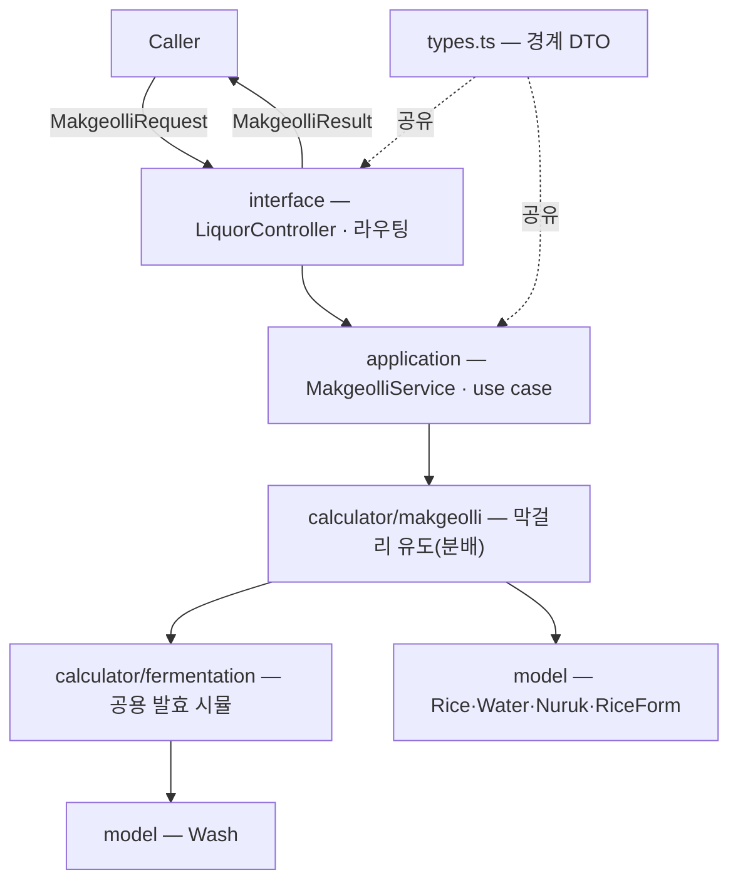
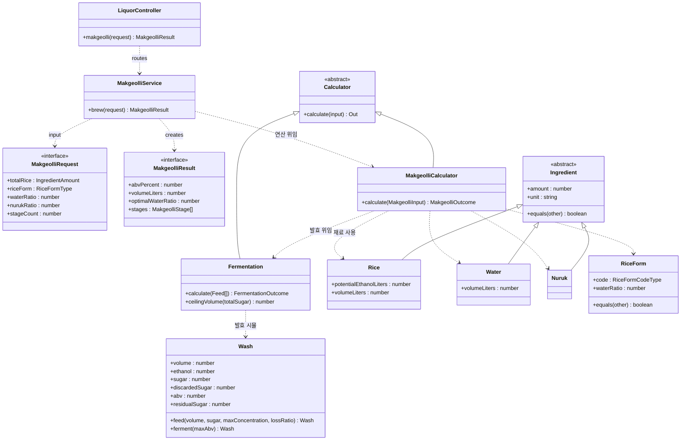

# @alcolmeter/domain-v2

술 빚기·도수 추정 도메인 패키지. 기존 `@alcolmeter/domain`을 완전히 대체할 v2 (작업 중).
전통주에 한정하지 않는다 — **발효주**(막걸리·청주, 와인 등)를 먼저 다루고, **증류주**(술덧을 증류)·**담금주**(침출주)를 추후 평행 경로로 추가한다.

> ⚠️ **WIP** — 막걸리 경로(`LiquorController.makgeolli`)가 구현됨. 계수·분배 규칙은 **캘리브레이션 전 임시값**이라 절대 수치는 신뢰하지 말 것. 보장하는 건 *거동*(발효횟수↑→도수↑, 진할수록↑·내성 한도)까지다.

## 계층 구조

의존 방향 `interface → application → calculator → model`. 공개 표면은 `LiquorController`와 `types.ts`의 DTO뿐이고, 나머지(서비스·계산기·도메인 모델)는 내부 전용이다. `LiquorController`는 술 종류별로 라우팅한다 — 막걸리 `makgeolli()`, 추후 청주·증류주 등으로 평행하게 늘린다. 공용 순수 헬퍼는 `utils/`(`*-helper.ts`)에 둔다.



**핵심 분리 — 유도 ⟂ 발효.** 발효 시뮬(`Fermentation`)은 *단계별 투입을 받아 도수를 내는* 물리/화학이라 **모든 발효주 공용**이다. 술마다 다른 건 **유도**(재료를 단계별로 어떻게 나누나)뿐. 그래서 술별 계산기(`MakgeolliCalculator` 등)는 자기 유도로 단계 계획만 짜서 공용 `Fermentation`에 넘긴다. 의존은 `막걸리 → 발효` 한 방향.

## 발효 시뮬 (`calculator/fermentation`, 공용 foundation)

단계별 투입(`Feed = {부피, 당}`) 시퀀스를 받아 `Wash`로 순차 발효시켜 도수·생산량·잔당을 낸다. 술 종류·재료 형태는 **모른다.**

각 단계마다:
1. **투입(`Wash.feed`)** — 부피·당 누적. 당 농도가 한계(`C_max`)를 넘으면, 그 초과분 중 `lossRatio`만 효모 삼투압 스트레스로 굳어 **잔당으로 영구 손실**되고 나머지는 용존으로 남아 다음 희석 때 다시 발효된다. (초과분 전부가 아니라 일부만 버리므로 한 번에 부어도 도수가 한 값으로 고정되지 않는다.)
2. **발효(`Wash.ferment`)** — 용존 당을 에탄올로 전환. 도수가 **내성(`maxAbv`)** 에 닿거나 당이 소진될 때까지.

당은 **"에탄올 환산 L"(잠재 알코올)** 로 다뤄 에탄올·여유분과 같은 자에서 직접 비교한다. 당→에탄올 화학량론 변환은 모델 바깥(재료 레이어)에서 적용한다. **나눠 담글수록(N↑)** 단계 사이 발효가 당을 비워 더 많은 당이 발효된다 → 도수↑.

| 발효 상수 (임시값) | 값 | 의미 |
|---|---|---|
| `MAX_SUGAR_CONCENTRATION` | 0.05 | 한 단계에 녹는 당 농도 한계(에탄올 환산 분율) |
| `MAX_ABV` | 0.185 | 효모 내성 — 도달 가능한 최대 도수 |
| `EXCESS_LOSS_RATIO` | 0.6 | 농도 초과분 중 굳어 손실되는 비율 |

---

## 막걸리 계산 과정

입력 **총 쌀 R**(g) · **밑술 쌀 형태 F**(고두밥/떡/범벅/죽) · **급수율 w**(물/쌀) · **누룩비율 u**(누룩/쌀) · **발효횟수 N**.
출력 **예상 도수 · 생산량 · 최적 급수율 · 단계별 투입 분배(쌀·물·누룩·형태)**.

흐름은 **유도(분배) → 발효 시뮬 → 결과 조립** 세 단계다.

### 1단계 — 유도 (단계별 분배 계획)

#### ① 쌀 분배 — 밑술 고정 + 덧술 점증

밑술은 효모를 키우는 최소 단위라 **고정 비율**로 작게 두고, 나머지를 덧술에 **점증**으로 키운다(갈수록 큰 덧술).

```
N = 1:  쌀₁ = R
N ≥ 2:  밑술  쌀₁ = R · 0.15
        덧술  쌀ₖ = (R − 쌀₁) · k / Σ        (k = 1 … N−1,  Σ = (N−1)N/2)
```

예) N=3 → 밑술 15% · 덧술 28.3% · 덧술 56.7%.

#### ② 단계별 쌀 형태 — 마지막은 고두밥

```
N = 1:  [F]
N ≥ 2:  밑술·중간 덧술 = F,   마지막 덧술 = 고두밥(되직)
```

#### ③ 물 분배 — 총량은 급수율, 분배는 형태

물의 **총량**은 급수율이 정하고(`W = R · w`), 그 물을 단계별 **`쌀 × 형태급수비율`** 에 비례해 나눈다. 형태의 급수비율(고두밥 0·떡 1·범벅 3·죽 5)은 *얼마나 묽게*의 **상대 가중**일 뿐, 총량은 안 바꾼다.

```
가중 gₖ = 쌀ₖ · ratio(형태ₖ)
물ₖ = W · gₖ / Σg            (Σg > 0)
Σg = 0(전부 고두밥 등) → 쌀량 비례로 폴백:  물ₖ = W · 쌀ₖ / R
```

마지막 고두밥(급수비율 0)은 물을 거의 안 받아 **되직**, 앞 단계(죽·범벅)는 묽다. 총 물은 급수율대로 보존된다.

> 형태가 도수에 미치는 영향은 작다(텍스처·표시 위주). 같은 형태 단계끼리는 급수비율이 정규화에서 상쇄돼, **죽·범벅·떡은 도수가 사실상 같고** '고두밥(물 0)'만 숫자에 드러난다. 이는 "급수율이 물을 정하고 형태는 분배만"이라는 설계의 귀결이다.

#### ④ 누룩 — 전량 밑술

```
누룩₁ = R · u,   나머지 단계 = 0
```

### 2단계 — 발효 시뮬

각 단계의 분배를 `Feed`로 환산해 공용 `Fermentation`에 순차로 넘긴다.

```
부피ₖ = riceVolume(쌀ₖ) + waterVolume(물ₖ)      // L
당ₖ   = potentialEthanol(쌀ₖ)                    // 에탄올 환산 L
도수·생산량·잔당 = Fermentation.calculate([Feed₁, Feed₂, …])
```

| 재료 계수 (임시값) | 값 |
|---|---|
| 쌀 → 잠재 에탄올 | 0.32 L/kg (이론 ~0.42에서 지게미·효모 생존 비용 차감) |
| 쌀 → 부피 기여 | 0.30 L/kg |
| 밑술 쌀 비율 | 0.15 |

### 3단계 — 최적 급수율 추천

도수를 **잔당 없이 최대(내성)** 로 내는 급수율. 모든 당이 발효돼 도수가 내성에 딱 닿는 부피에서 역산한다.

```
최적 총부피 V* = 총당 / 내성 = potentialEthanol(R) / MAX_ABV
최적 물      = max(0, V* − riceVolume(R))
최적 급수율   = 최적 물(g) / R(g)
```

이보다 물이 적으면 도수는 내성에서 멈추고 **잔당만 늘고**, 많으면 묽어져 **도수가 낮아진다.**

### 거동 / 한계

- **발효횟수↑ → 도수↑**(포화), **급수율↑ → 도수↓**(내성 한도), **6도 고정 없음**, 도수 ≤ 내성.
- 계수·밑술비율·형태급수비율은 **캘리브레이션 전 임시값**. 절대 수치 신뢰 금지.
- 형태의 5/3/1 구분은 현재 도수에 거의 안 드러난다(위 ③ 참고).

---

## 새 술 추가하기

발효주라면 **발효 시뮬(`Fermentation`)을 재사용**하고, 그 술의 **유도만** 새로 쓴다.

1. `model/`에 필요한 도메인 값 추가(예: `rice-form`). 모델은 데이터·고유 행동만.
2. `calculator/{술}/`에 계산기 추가 — 그 술의 분배 규칙으로 `StageComposition[]`을 만들고 → `Feed[]`로 환산 → `Fermentation`에 넘김. `Calculator<In, Out>` 상속.
3. `application/`에 서비스 추가(DTO ↔ 도메인 번역), `interface/`의 `LiquorController`에 라우팅 메서드, `types.ts`에 경계 DTO.

발효 물리(내성·손실)는 손대지 않는다 — 한 곳(`Fermentation`)에만 둔다.

## 모델 관계



`MakgeolliService`(application)는 입력 DTO를 도메인 입력으로 옮겨 **`MakgeolliCalculator.calculate`** 에 넘기고, 계산기가 유도로 단계 계획을 짠 뒤 **`Fermentation`** 에 위임해 도수를 낸다. 모델 객체(`Rice`·`Water`·`Nuruk`·`RiceForm`·`Wash`)는 자기 고유 데이터·행동만 갖고, **여러 모델을 엮는 연산은 calculator**가 맡는다. `Nuruk`는 현재 도수·부피 기여가 0이다(추후 역가 반영 여지).

## 테스트

```bash
pnpm --filter @alcolmeter/domain-v2 test
```
