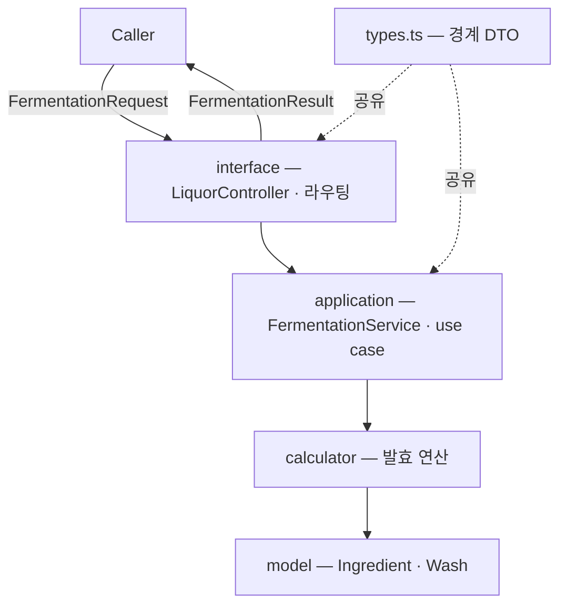
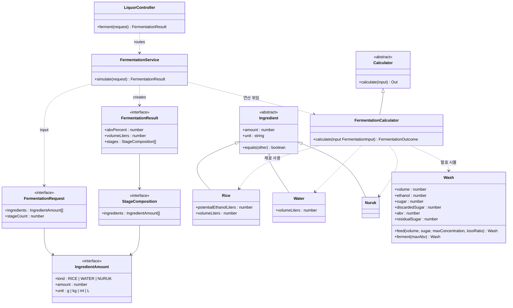

# @alcolmeter/domain-v2

술 빚기·도수 추정 도메인 패키지. 기존 `@alcolmeter/domain`을 완전히 대체할 v2 (작업 중).
전통주에 한정하지 않는다 — **발효주**(막걸리·청주, 와인 등)를 먼저 다루고, **증류주**(술덧을 증류)·**담금주**(침출주)를 추후 평행 경로로 추가한다. 재료도 쌀·물·누룩에서 배·포도 등으로 확장한다.

> ⚠️ **WIP** — `FermentationService.simulate`(재료 변환 → 유도 분배 → 발효 시뮬) 초기 버전 구현됨. 계수·유도 규칙은 캘리브레이션 전 임시값이라 절대 수치는 신뢰하지 말 것.

## 계층 구조

의존 방향 `interface → application → calculator → model` (calculator = 여러 모델을 엮는 발효 연산). 공개 표면은 `LiquorController`와 `types.ts`의 DTO뿐이고, 나머지(서비스·도메인 모델)는 내부 전용이다. `LiquorController`는 술 종류별로 라우팅한다 — 발효주 `ferment()`, 추후 담금주 `infuse()`·증류주 `distill()`. 공용 순수 헬퍼는 `utils/`(`*-helper.ts`)에 둔다.



## 모델 관계



`FermentationService`(application)는 입력을 `Rice`/`Water`/`Nuruk`로 모아 **`FermentationCalculator.calculate(input)`** 에 넘기고, 계산기가 재료 + `Wash`로 단계별 발효를 시뮬해 결과를 낸다. 각 계산기는 추상 `Calculator`를 상속해 `calculate`를 구현한다. 모델 객체는 자기 고유 행동(재료의 당·부피, `Wash`의 상태 전이)만 갖고, **여러 모델을 엮는 연산은 calculator**가 맡는다. `Nuruk`는 현재 도수·부피 기여가 0이다(추후 효모 용량 반영 여지).

## 발효 모델

예상 도수는 **단계별 발효 시뮬레이션**으로 구한다.

- **입력**: 각 재료 총량 + 총 발효횟수 N · **출력**: 예상 도수 · 생산량 · 담금별 투입 분배
- 각 단계: 물·당 투입(`Wash.feed`) → 당 농도가 한계를 넘으면 그 초과분 중 **일부만 단맛(잔당)으로 굳어 손실**되고 나머지는 남아 다음 희석 때 다시 발효 → 내성까지 발효(`Wash.ferment`)
- **나눠 담글수록(N↑)** 단계 사이 발효가 당을 비워 더 많은 당이 발효됨 → 도수↑ (발효횟수가 도수에 영향)
- 당은 **"에탄올 환산"(잠재 알코올)** 으로 다뤄 에탄올·여유분과 같은 자에서 비교한다. 당→에탄올 화학량론 변환은 모델 바깥(재료 레이어)에서 적용한다.
- **유도(분배)**: 단계가 갈수록 커진다 — 물은 앞 단계에 많이(묽은 밑술), 쌀은 뒤 단계에 많이(된 덧술), 누룩은 1단계(밑술)에 전량.
- ⚠️ 계수(쌀 수율·내성·농도 한계·손실 비율)는 캘리브레이션 전 임시값이라 절대 수치는 신뢰하지 말 것. 거동(발효횟수↑→도수↑, 진할수록↑·내성 한도)만 맞춰 둔 상태.

## 테스트

```bash
pnpm --filter @alcolmeter/domain-v2 test
```
