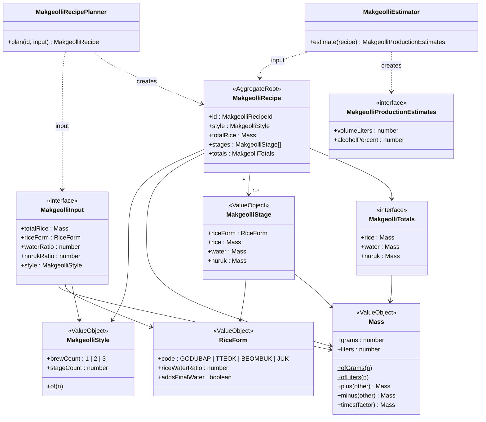

# @alcolmeter/domain

전통주(막걸리 등) 양조 배합 계산 도메인 패키지.

## 모델 관계



## 정밀도

모든 양 계산은 **소수점 5자리**까지 보장한다.

- 반올림 기준: `Math.round(n × 1e5) / 1e5`
- 연산(`plus`, `minus`, `times`) 결과마다 반올림을 적용하여 부동소수점 누적 오차를 방지한다.

```ts
Mass.ofGrams(800 / 6).grams; // 106.66667 (33.33333...이 아님)
```

## 양조 방식

| brewCount | 단계 수 | 밑술 쌀 비율(기본값) | 비고                      |
| --------- | ------- | -------------------- | ------------------------- |
| 1         | 1       | 전량(100%)           | 전량 한 번에 투입         |
| 2         | 2       | 20%                  | 물 예산 초과 시 자동 축소 |
| 3         | 3       | 15%                  | 물 예산 초과 시 자동 축소 |

밑술/덧술 쌀량은 물 예산(`MakgeolliInput.totalRice × waterRatio`)을 초과하지 않도록 자동 조정된다.

## 누룩 규칙

- 누룩은 **밑술에만** 전량 투입된다.
- `nurukRatio`는 **쌀 총량** 기준 비율이다.
  - 예: 쌀 1000 g, `nurukRatio = 0.1` → 누룩 100 g

## 쌀 가공 형태

| 코드       | 명칭     | 밑술 쌀:물 비율 |
| ---------- | -------- | --------------- |
| `GODUBAP`  | 고두밥   | 1 : 0 (물 없음) |
| `TTEOK`    | 떡(설기) | 1 : 1           |
| `BEOMBUK`  | 범벅     | 1 : 3           |
| `JUK`      | 죽       | 1 : 5           |

## 테스트

```bash
pnpm --filter @alcolmeter/domain test
```
